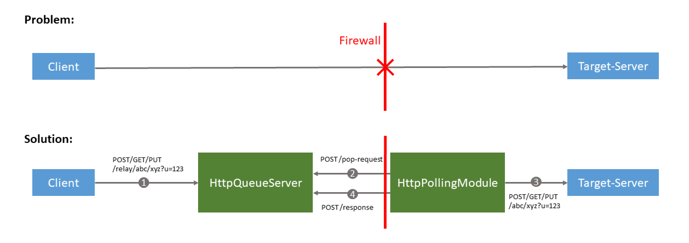

# HttpQueueServer

The functionality and purpose of this Java web server application can be seen in the following diagram:



If there are firewall restrictions that prevent HTTP connections coming from the outside,
the HTTPQueueServer and the [`HttpPollingModule`](https://github.com/stefan-m-lenz/HttpPollingModule) can allow that a client can still access a target server behind the firewall via HTTP.

Wrapping the `HttpQueueServer` in a reverse proxy like *nginx*, the server running the `HttpQueueServer` behaves for the HTTP client in the same way as the target server.
For security reasons it must be ensured via firewall and/or reverse proxy configuration that the endpoints `/pop-request` and `/response` can only be reached by the `HttpPollingModule`.

## Installation

The `HttpQueueServer` is a Java web application based on the Java/Jakarte EE 8 standard.
It can be deployed in a [Tomcat 9 web server](https://tomcat.apache.org/) or any other servlet container that supports the Java Servlet Specification 4.0.

The following script shows how the `HttpQueueServer` can be installed on an Ubuntu 18.04 server:

```bash
# Install Tomcat 9
sudo apt-get install tomcat9

# Run Tomcat as a service that will always start when the system boots up
sudo systemctl start tomcat9
sudo systemctl enable tomcat9

# Download the HttpQueueServer web archive file and deploy it on Tomcat
wget https://github.com/stefan-m-lenz/HttpQueueServer/releases/download/v1.0.1/HttpQueueServer.war
sudo mv HttpQueueServer.war /var/lib/tomcat9/webapps
```

For a use in production, it is necessary to install and configure a reverse proxy.

## Install and configure *Nginx* as reverse proxy
Setting up a reverse proxy for the queue server allows to enable communication via HTTPS.
Secondly, the reverse proxy configuration must ensure that the server endpoints `/pop-request` and `/response` are only accessible by the (server running) the polling module.
Otherwise, users could potentially intercept other users' requests.

Assuming the base URL of the queue server is https://queue.example.com, the reverse proxy configuration is supposed to do something like the following:

* Redirect https://queue.example.com/relay/* to http://localhost:8080/HttpQueueServer/relay/*.
* Restrict the access to https://queue.example.com/pop-request to the polling module and redirect requests to https://queue.example.com/pop-request to http://localhost:8080/HttpQueueServer/pop-request.
* Restrict the access to https://queue.example.com/response to the polling module and redirect requests to https://queue.example.com/response to http://localhost:8080/HttpQueueServer/response.


Nginx can be installed and configured via the following commands:
```bash
sudo apt-get install nginx
```

One possibility of restricting the endpoints `/pop-request` and `/response` is to allow only the server that runs the polling module to access these requests.
This can be achived by restricting the endpoints to the IP of the server running the polling module.
If the server running the polling module is behind a proxy and the IP address cannot be used to secure the access to the endpoints `/pop-request` and `/response`, it is necessary to secure these endpoints via client certificates.
The necessary steps are shown in the following.
To generate and deploy client certificates, run the following commands:

```bash
# Create a certificate authority (key)
openssl genrsa -des3 -out ca.key 4096

# Sign a server side certificate used for client-side authentication
openssl req -new -x509 -days 365 -key ca.key -out ca.crt

# Create the key for the polling module
openssl genrsa -des3 -out polling.key 4096

# Create certificate signing request
openssl req -new -key polling.key -out polling.csr

# Sign the certificate signing request with the certificate authority
openssl x509 -req -days 365 -in polling.csr -CA ca.crt -CAkey ca.key -set_serial 01 -out polling.crt

# Create the client side certificate key for the polling module
# Important: use a different organization name than in the certificate authority
# (otherwise Nginx gives an error: https://stackoverflow.com/a/47115211/3180809)
openssl pkcs12 -export -out polling.pfx -inkey polling.key -in polling.crt -certfile ca.crt

# Clean up files that are not needed any more
rm polling.csr polling.crt polling.key

# Move the server certificate authority files to the folder with the Nginx configuration files
sudo mv ca.crt ca.key /etc/nginx/conf.d
```

The file `polling.pfx` must be transferred to the server where the polling module runs.
It serves as a key for the client authentication.
For the configuration in the polling module, see the configuration property `queueClientAuthCert` in the [description of the polling module](https://github.com/stefan-m-lenz/HttpPollingModule).

Open an editor to configure Nginx:

```bash
sudo vi /etc/nginx/nginx.conf
```

A minimal `nginx.conf` configuration file looks like this:

```
events {
}
http {
   server {
      listen 443 ssl;

      # Server certificate, shown to user
      ssl_certificate /etc/ssl/certs/nginx-selfsigned.crt;
      ssl_certificate_key /etc/ssl/private/nginx-selfsigned.key;

      # Client side authentication, only for polling module
      ssl_client_certificate /etc/nginx/conf.d/ca.crt;
      ssl_verify_client optional;

      location /relay/ {
         proxy_pass http://localhost:8080/HttpQueueServer/relay/;
      }

      location /pop-request {
         if ($ssl_client_verify != SUCCESS) {
            return 403;
         }
         proxy_pass http://localhost:8080/HttpQueueServer/pop-request;
      }

      location /response {
         if ($ssl_client_verify != SUCCESS) {
            return 403;
         }
         proxy_pass http://localhost:8080/HttpQueueServer/response;
      }
   }
}
```

The self-signed server certificate `/etc/ssl/certs/nginx-selfsigned.crt` was generated with the command `sudo openssl req -x509 -nodes -days 365 -newkey rsa:2048 -keyout /etc/ssl/private/nginx-selfsigned.key -out /etc/ssl/certs/nginx-selfsigned.crt`.
For a production deployment, a valid certificate should be provided instead.

# Firewall configuration

If the communication between queue server and polling module works, finally ensure that the firewall blocks access to port 8080 to prevent that the queue can be accessed by users.
The firewall must allow access to port 443 for all users.